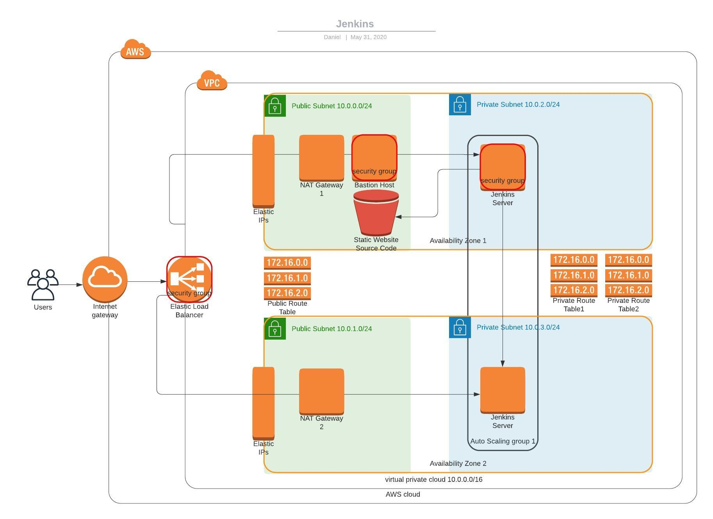

# Course-Exploring_Jenkins
Udacity Cloud DevOps Engineer Nano Degree Course 3

http://jenki-jenki-1bdokdp6tz04u-121480052.us-west-2.elb.amazonaws.com/

The command to log into the the Bastion using SSH:

`ssh ec2-user@0.0.0.0 -i bastion-key.pem`

(replce with public ip address)

To trasnfer a key over:

`scp -i bastion-key.pem jenkins-key.pem ubuntu@0.0.0.0:/home/ec2-user/jenkins-key.pem`

(replce 0.0.0.0 with public ip address)

To list docker containers:

`docker container ls`

To get initial admin password:

`docker exec aaaaaa00000 cat /var/jenkins_home/secrets/initialAdminPassword`

(replace aaaaaa00000 with Container ID)

If you need to execute a command inside of a running Docker:

`sudo docker exec -u root -it <docker_name> <shell_commands>`

Jenkins Plugins:
- Blue Ocean (create pipelines)
- Pipeline: AWS Steps (get aws credentials w/ CloudFormation)
- Safe Restart (avoid cli restarts of Jenkins)
- Aqua MicroScanner (get token @ https://microscanner.aquasec.com/signup)

Configurations:
- AWS Credentials (JenkinsIAMKeys)
- Scan Repository Triggers = 1 min
- Aqua Microscanner Token
- Docker

